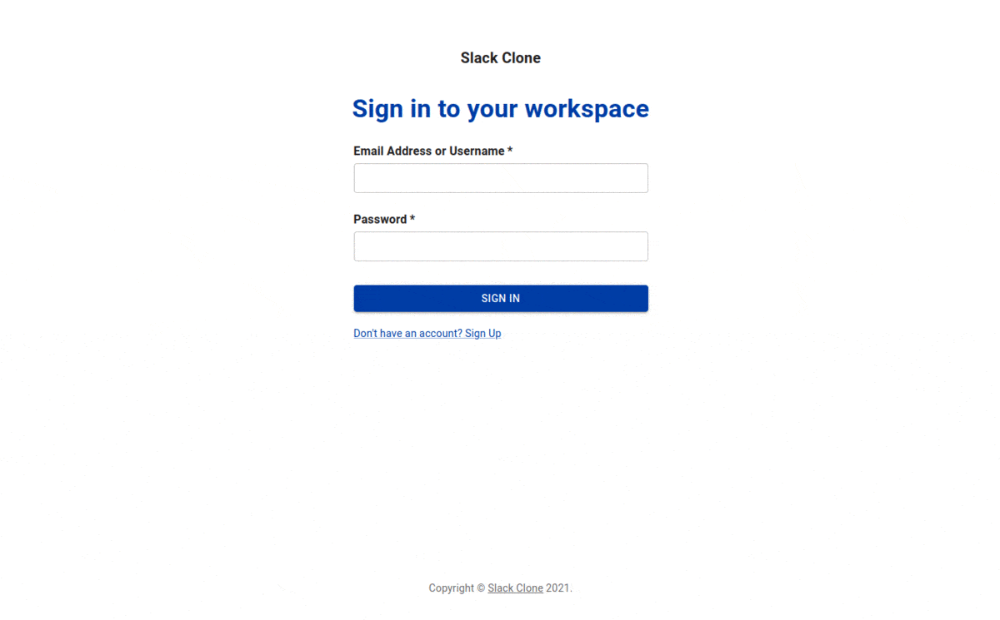

# slack-clone

This is a Slack clone made with React, Nodejs, GraphQL, and MongoDB.



## Launch it

### With Docker Compose

You can run it by using [Docker Compose](https://docs.docker.com/compose) using the command:

```bash
docker-compose up -d
```

### Withtout Docker Compose

You can also run it without Docker Compose by installing locally [Nodejs](https://nodejs.org), [Yarn](https://yarnpkg.com), and [MongoDB](https://www.mongodb.com) first, the Node v14.18 was used during development.

Then run this command in the root folder:

```bash
cd client && yarn && yarn start
```

after that open annother terminal in the root folder and run:

```bash
cd server && npm install && npm start
```

Now open the browser at [http://localhost:3000](http://localhost:3000),
and enjoy it!
